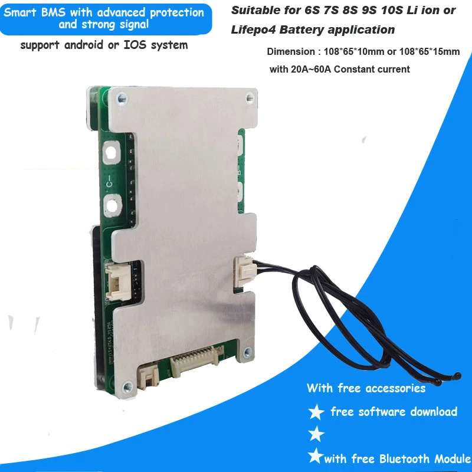
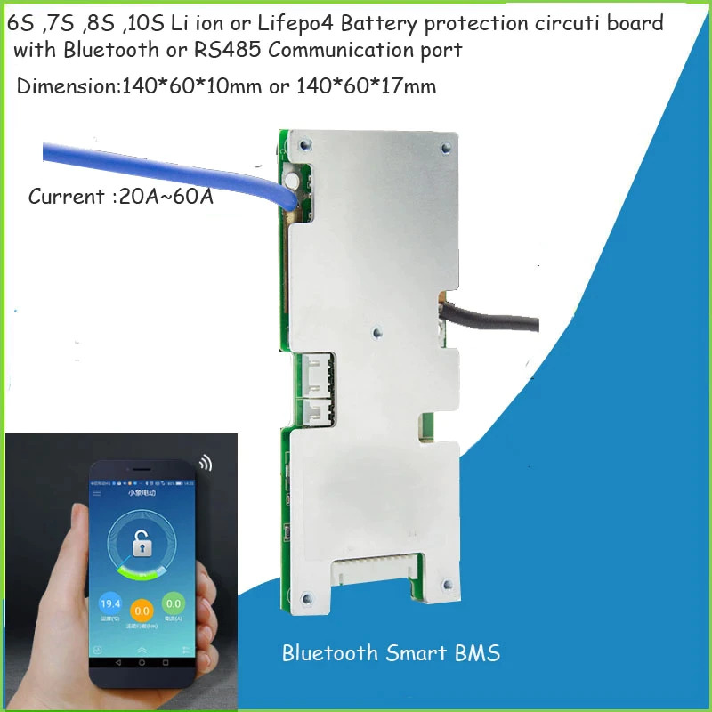
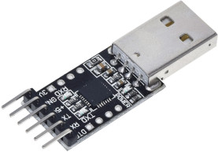
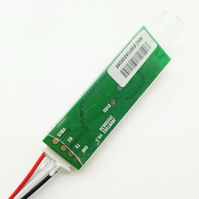
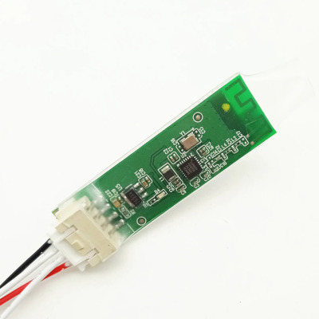

smart_bms
======

Python connector for Chinese Bluetooth Smart BMS like in the pictures below (also ones branded as QUCC BMS):



# Library

There are two transports provided:

- **Serial** - for use with UART USB converters,<br/>
  
- **BLE** - for use with the original Bluetooth Low Energy module supplied with the BMS<br/>
  
  

# Example

```python
import asyncio

from smart_bms.SmartBMSClient import SmartBMSClient
from smart_bms.TransportBLE import TransportBLE


async def main():
    tr = TransportBLE("xx:xx:xx:xx:xx:xx")
    await tr.start()

    client = SmartBMSClient(tr)

    while True:
        print(await client.read_basic_information())
        print(await client.read_cell_voltages())
        await asyncio.sleep(1)


asyncio.run(main())
```

## Example output

```
SmartBMSBasicInformation(voltage=58550, current=0, remaining_capacity=6800,
  nominal_capacity=6800, cycles=1, prod_date=11455, protection_status=0, soft_ver=34,
  rem_cap=100, charging_open=True, discharging_open=True, cells_count=14,
  temperatures=[24.6, 21.8, 21.6], 
  cell_balancing_status=[
    False, False, False, False, False, False,
    False, False, False, False, False, False, False, False])
[4178, 4182, 4181, 4180, 4178, 4184, 4183, 4185, 4180, 4183, 4185, 4186, 4184, 4183]
```

## Requirements

* [Bleak](https://bleak.readthedocs.io/en/latest/) - Python BLE client
